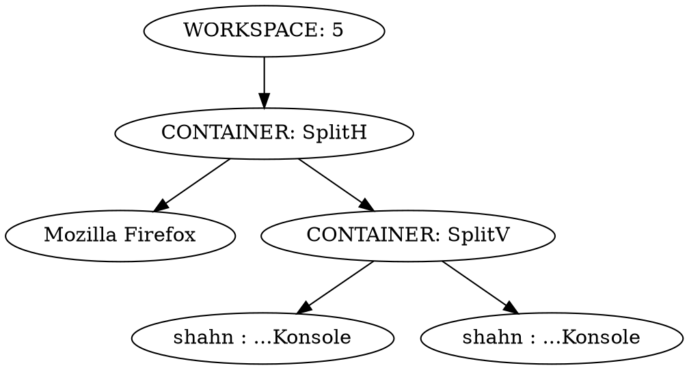
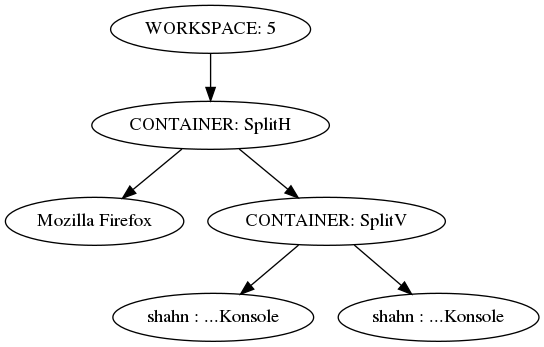

# i3-pretty-tree

Prints out the tree of the i3 containers of the current workspace in [dot](https://www.graphviz.org/) format.

Example output:

```dot
digraph g {
n94027044503440 [ label = "WORKSPACE: 5" ];
n94027044503440 -> n94027044013552;
n94027044013552 [ label = "CONTAINER: SplitH" ];
n94027044013552 -> n94027044558032;
n94027044013552 -> n94027044047920;
n94027044047920 [ label = "CONTAINER: SplitV" ];
n94027044047920 -> n94027044338176;
n94027044047920 -> n94027043894912;
n94027043894912 [ label = "shahn : ...Konsole" ];
n94027044338176 [ label = "shahn : ...Konsole" ];
n94027044558032 [ label = "Mozilla Firefox" ];
}
```

Rendered:

