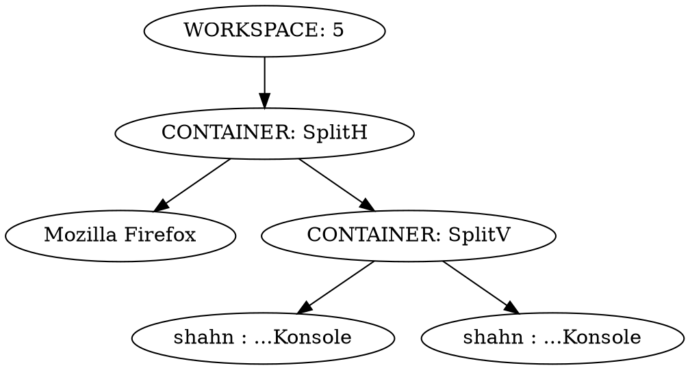

# i3-pretty-tree

Prints out the tree of the [i3](https://i3wm.org/) containers of the current workspace in [dot](https://www.graphviz.org/) format.

Example output:

Rendered:

## Motivation

`i3` puts windows in a tree structure.
When I started using it, I found it difficult to wrap my head around
that though:
which window was in which container,
which container was in which parent container,
which keyboard shortcuts to use to navigate that tree
or move nodes around in it.
So I wrote `i3-pretty-tree` to help with that.
I added [this keyboard shortcut](https://github.com/soenkehahn/dotfiles/blob/c11e56cfe3b4c1cace8320540aea1e9c0c96e576/.config/i3/config#L61) to be able to quickly bring up the current window structure on screen and look at it.
That helped me get used to `i3`'s tree structure.
(Now that I'm used to it, I hardly use `i3-pretty-tree` anymore.)
